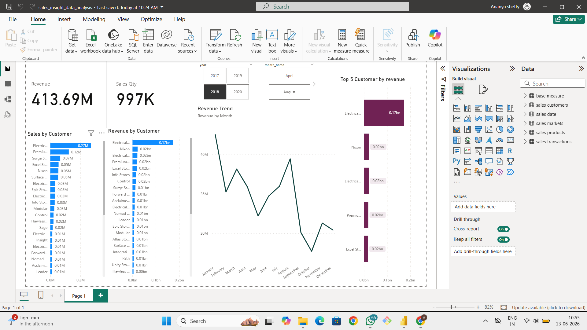
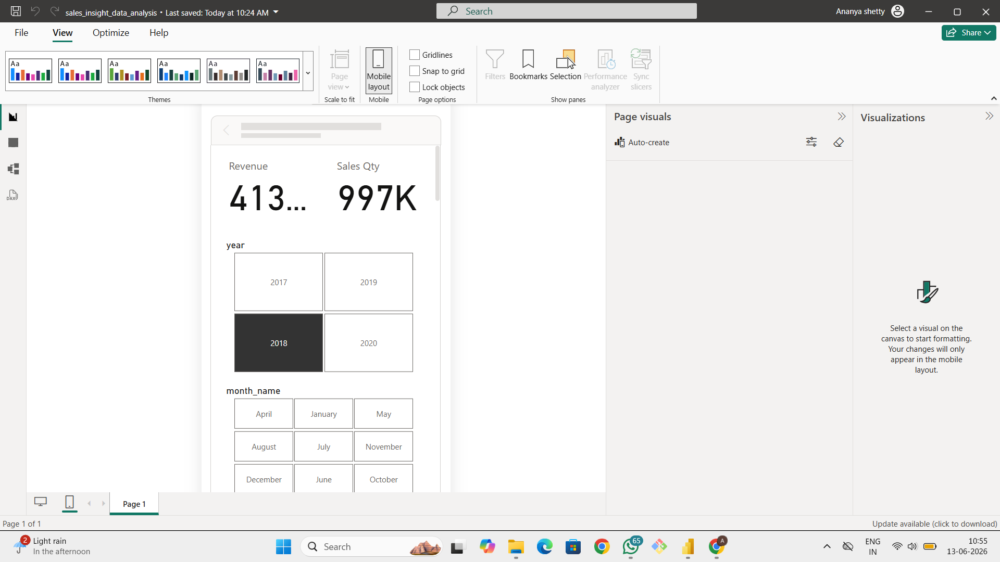
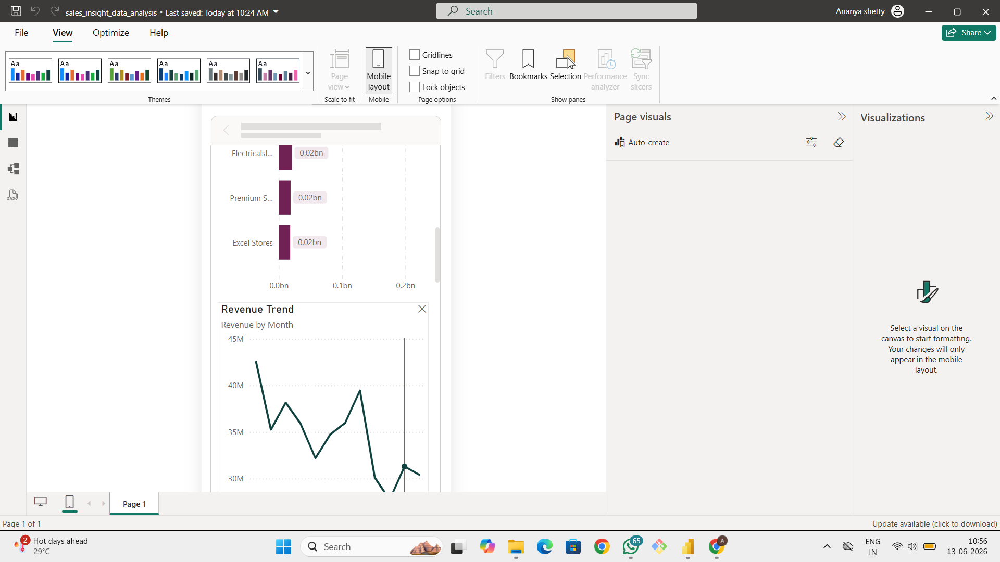

# 🚀 Revenue Intelligence Dashboard for AtliQ Hardware

### End-to-End Sales Analytics Project using SQL, MySQL & Power BI

Transforming raw sales data into actionable business insights through data analysis, visualization, and business intelligence.

---

## 📖 Project Overview

This project is based on a real-world business scenario involving **AtliQ Hardware**, a leading computer hardware and peripherals company operating across multiple markets in India.

As the business expanded, management faced challenges in tracking sales performance, identifying revenue trends, and making timely business decisions due to fragmented reporting systems and manually generated reports.

To address these challenges, the Sales Director initiated a Business Intelligence project aimed at building a centralized Power BI dashboard capable of providing real-time sales insights and enabling data-driven decision-making.

Using SQL, MySQL, Power Query, and Power BI, sales transaction data was analyzed, transformed, and visualized to create an interactive dashboard that helps stakeholders monitor revenue performance, market trends, and product-level insights.

---

## 🎯 Business Problem

AtliQ Hardware's sales team struggled with:

* Lack of real-time visibility into sales performance
* Time-consuming manual reporting processes
* Difficulty identifying high-performing and underperforming markets
* Limited insights into revenue trends and product performance
* Delayed decision-making due to fragmented data sources

---

## 💡 Business Objective

Develop a centralized Revenue Intelligence Dashboard that enables business leaders to:

✅ Track sales performance across markets

✅ Monitor revenue trends over time

✅ Analyze product performance

✅ Identify growth opportunities

✅ Make faster and more informed business decisions

---

## 🛠️ Technology Stack

| Technology  | Purpose                               |
| ----------- | ------------------------------------- |
| SQL         | Data Analysis & Querying              |
| MySQL       | Database Management                   |
| Power Query | Data Cleaning & Transformation        |
| DAX         | KPI Calculations                      |
| Power BI    | Dashboard Development & Visualization |

---

## 📂 Dataset Information

The project utilizes sales transaction data from AtliQ Hardware, including:

* Customers
* Products
* Transactions
* Markets
* Date Table

The dataset was imported into MySQL using the provided SQL dump file and connected to Power BI for reporting and visualization.

---

## 🔄 Data Cleaning & Transformation

Data preparation was performed using Power Query:

* Removed invalid transaction records
* Handled currency inconsistencies
* Converted USD transactions into INR
* Created a normalized sales amount column
* Prepared data for KPI calculations and dashboard reporting

### Power Query Formula

```powerquery
= Table.AddColumn(
    #"Filtered Rows",
    "norm_amount",
    each if [currency] = "USD" or [currency] = "USD#(cr)"
    then [sales_amount] * 75
    else [sales_amount]
)
```

---

## 📊 Dashboard Features

### Executive Overview

* Total Revenue
* Total Sales Quantity
* Revenue Trend Analysis
* Year-over-Year Performance

### Market Analysis

* Revenue by Market
* Sales Quantity by Market
* Market Contribution Percentage

### Product Analysis

* Top Performing Products
* Product Revenue Distribution
* Product Sales Trends

### Time Analysis

* Monthly Revenue Trends
* Yearly Performance Analysis
* Seasonal Revenue Patterns

### Interactive Features

* Dynamic Slicers
* Drill-Down Analysis
* Market-Level Filtering
* Time-Based Exploration

---

## 📈 Key Business Insights

* Delhi NCR contributes the highest share of overall revenue.
* Revenue trends reveal seasonal fluctuations across markets.
* A small group of products generates a significant percentage of total revenue.
* Chennai market maintains stable transaction volume throughout the year.
* Interactive reporting significantly reduces manual reporting efforts.

---

## 🗄️ SQL Analysis Performed

### Total Number of Customers

```sql
SELECT COUNT(*) FROM customers;
```

### Transactions in Chennai Market

```sql
SELECT *
FROM transactions
WHERE market_code='Mark001';
```

### Distinct Products Sold in Chennai

```sql
SELECT DISTINCT product_code
FROM transactions
WHERE market_code='Mark001';
```

### Transactions in 2020

```sql
SELECT transactions.*, date.*
FROM transactions
INNER JOIN date
ON transactions.order_date = date.date
WHERE date.year = 2020;
```

### Total Revenue in 2020

```sql
SELECT SUM(transactions.sales_amount)
FROM transactions
INNER JOIN date
ON transactions.order_date = date.date
WHERE date.year = 2020;
```

### Total Revenue in Chennai

```sql
SELECT SUM(transactions.sales_amount)
FROM transactions
INNER JOIN date
ON transactions.order_date = date.date
WHERE date.year = 2020
AND transactions.market_code='Mark001';
```

---

## 🖼️ Dashboard Preview

### Desktop View



### Mobile view1



### Mobile view2



---

## 🌐 Live Dashboard

**Power BI Service Report**

https://app.powerbi.com/groups/me/reports/58afb71d-3f54-4727-ba2e-7345f9435cf7/d834354006d60d5ec5d2?experience=power-bi

---

## 📁 Project Structure

```text
Sales_Insight_Analysis
│
├── README.md
├── db_dump.sql
├── sales_insight_data_analysis.pbix
├── dashboard_overview.png
├── desktop_view.png
└── mobile_view.png
```

---

## 🎓 Skills Demonstrated

* SQL Querying
* Database Management
* Data Cleaning
* Data Transformation
* Data Modeling
* KPI Development
* Business Intelligence
* Dashboard Design
* Data Visualization
* Analytical Thinking
* Business Insight Generation

---

## 📌 Project Outcome

Successfully developed an interactive Revenue Intelligence Dashboard that provides AtliQ Hardware's leadership team with a centralized view of sales performance, helping them identify trends, monitor KPIs, and make informed business decisions using data-driven insights.

---

## 👩‍💻 Author

### Ananya R Shetty

Aspiring Data Analyst

**Skills:** SQL | Power BI | Python | Excel | MySQL

Passionate about transforming data into actionable business insights and building impactful analytics solutions.

